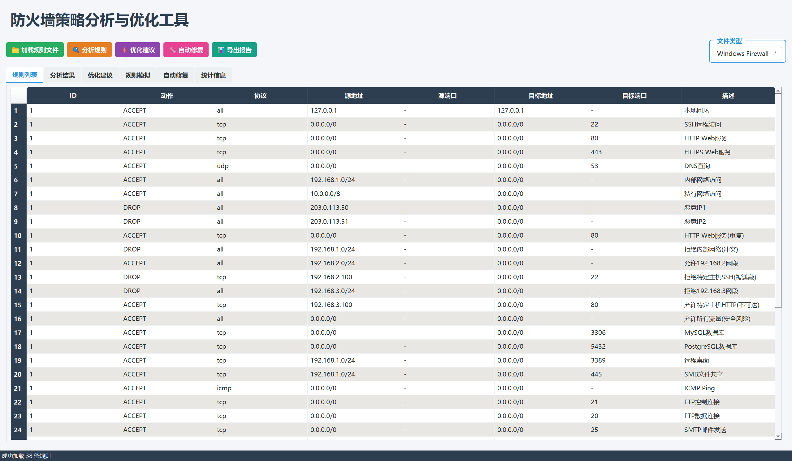
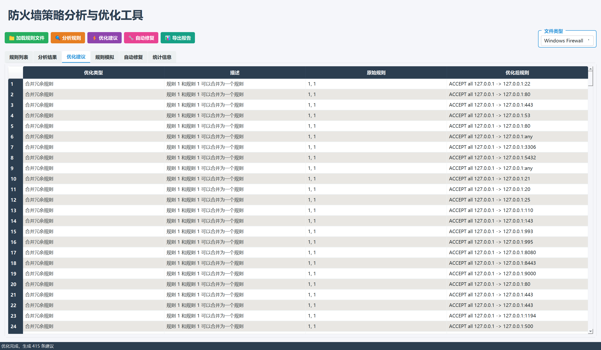
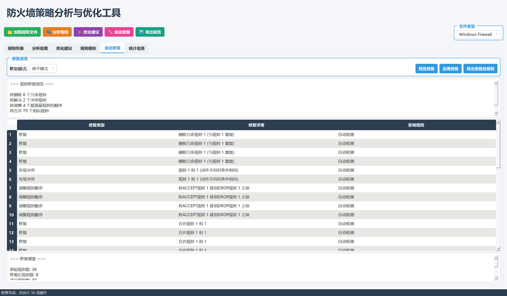
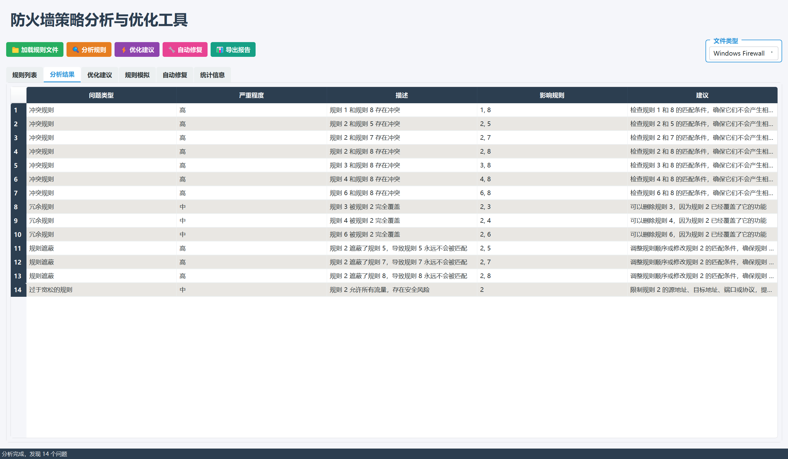

# 防火墙策略分析与优化系统
# 源码获取：https://mbd.pub/o/bread/mbd-YZWbkppwZg==

<p align="center">
  <b>基于 Python 和 PyQt5 的智能防火墙规则分析与优化工具</b>
</p>

<p align="center">
  <a href="#功能特性">功能特性</a> •
  <a href="#安装说明">安装说明</a> •
  <a href="#使用方法">使用方法</a> •
  <a href="#项目结构">项目结构</a> •
  <a href="#技术文档">技术文档</a>
</p>

---

## 📖 项目简介

防火墙策略分析与优化系统是一款专业的网络安全工具，旨在帮助安全管理人员高效地分析、审计和优化防火墙规则配置。通过智能算法检测规则中的潜在问题，并提供可操作的优化建议，从而提升网络安全防护能力。

### 🎯 核心能力

- 🔍 **智能分析** - 自动检测规则冲突、冗余和安全隐患
- 💡 **优化建议** - 提供具体的规则优化方案
- 📊 **可视化展示** - 直观的图形界面展示分析结果
- 📝 **报告导出** - 生成详细的分析报告

---

## ✨ 功能特性

### 1️⃣ 规则解析
- ✅ 支持 **iptables** 格式规则解析
- ✅ 支持 **Windows 防火墙** 规则格式
- ✅ 自动识别规则属性（动作、协议、IP地址、端口等）

### 2️⃣ 规则分析
| 分析类型 | 说明 | 风险等级 |
|---------|------|---------|
| 🔴 冲突检测 | 检测相互矛盾的规则 | 高 |
| 🟠 冗余检测 | 识别重复或被覆盖的规则 | 中 |
| 🟡 规则遮蔽 | 发现被前面规则遮蔽的规则 | 中 |
| 🔵 不可达规则 | 检测永远不会被匹配的规则 | 低 |
| 🟣 过于宽松规则 | 识别安全风险较高的宽松规则 | 高 |
| ⚪ 非常用端口 | 检测开放的非标准端口 | 中 |

### 3️⃣ 优化建议
- 🔄 **合并冗余规则** - 将相似规则合并以提高效率
- 📋 **优化规则顺序** - 调整规则顺序以提高安全性
- 🎯 **简化IP范围** - 简化复杂的IP地址范围
- 📁 **分组相似规则** - 为相似规则添加分组注释
- 🗑️ **删除重复规则** - 识别并建议删除完全重复的规则

### 4️⃣ 可视化展示
- 📊 规则列表表格展示
- 📈 分析结果表格展示
- 💡 优化建议表格展示
- 📉 统计信息图表展示
- 🎨 颜色标记不同类型的规则和问题

### 5️⃣ 报告导出
- 📄 导出完整的分析报告
- 📋 包含规则列表、分析结果、优化建议
- 💾 支持文本格式导出

---

## 🚀 安装说明

### 环境要求

- Python 3.7 或更高版本
- Windows / Linux / macOS

### 快速安装

```bash
# 克隆仓库
git clone https://github.com/yourusername/firewall-analyzer.git
cd firewall-analyzer

# 安装依赖
pip install -r requirements.txt
```

### 依赖包

| 包名 | 版本 | 说明 |
|-----|------|------|
| PyQt5 | >=5.15.0 | GUI框架 |
| ipaddress | >=1.0.23 | IP地址处理 |
| python-dateutil | >=2.8.2 | 日期时间处理 |

---

## 📖 使用方法

### 启动程序

```bash
python main.py
```

### 基本操作流程

```
┌─────────────────────────────────────────────────────────────┐
│  1. 加载规则文件  →  2. 分析规则  →  3. 查看优化建议  →  4. 导出报告  │
└─────────────────────────────────────────────────────────────┘
```

#### 1️⃣ 加载规则文件
- 点击 **"加载规则文件"** 按钮
- 选择防火墙规则文件
- 选择文件类型（iptables 或 Windows Firewall）

#### 2️⃣ 分析规则
- 点击 **"分析规则"** 按钮
- 查看分析结果和统计信息

#### 3️⃣ 查看优化建议
- 点击 **"优化建议"** 按钮
- 查看优化建议和收益分析

#### 4️⃣ 导出报告
- 点击 **"导出报告"** 按钮
- 选择保存位置和文件名

---

## 📁 项目结构

```
firewall-analyzer/
├── 📄 main.py                      # 主程序入口和GUI界面
├── 📄 rule_parser.py               # 规则解析模块
├── 📄 rule_analyzer.py             # 规则分析模块
├── 📄 rule_optimizer.py            # 规则优化模块
├── 📄 rule_simulator.py            # 规则模拟模块
├── 📄 rule_fixer.py                # 规则修复模块
├── 📄 requirements.txt             # 依赖包列表
├── 📄 sample_rules.txt             # 示例规则文件
├── 📄 test_iptables.txt            # iptables格式测试文件
├── 📄 test_windows_firewall.txt    # Windows防火墙格式测试文件
├── 📄 test_fix.py                  # 修复功能测试文件
├── 📄 test_fix_rules.txt           # 修复测试规则文件
└── 📄 README.md                    # 项目说明文档
```

---

## 🧪 测试文件说明

项目包含多个测试文件，用于验证各种规则分析功能：

### test_iptables.txt
iptables格式的测试文件，包含：
- ✅ 基础规则（回环接口、已建立连接）
- ✅ 常见服务规则（SSH、HTTP/HTTPS、DNS、数据库）
- ✅ 内部网络访问规则
- ✅ 恶意IP拒绝规则
- ⚠️ **冗余规则**：重复的HTTP规则
- ⚠️ **冲突规则**：先允许后拒绝同一网段
- ⚠️ **遮蔽规则**：宽松规则遮蔽具体规则
- ⚠️ **不可达规则**：DROP后面的规则
- ⚠️ **过于宽松规则**：允许所有流量
- ⚠️ 非常用端口规则

### test_windows_firewall.txt
Windows防火墙格式的测试文件，包含：
- ✅ CSV格式规则（动作,协议,源IP,目标IP,源端口,目标端口,描述）
- ✅ 与iptables测试文件类似的规则结构
- ⚠️ 包含重复、冲突、遮蔽等问题规则

---

## 📚 技术文档

### 模块说明

#### 🔧 rule_parser.py
规则解析模块，负责解析不同格式的防火墙规则：
- `FirewallRule`：规则数据类
- `RuleParser`：规则解析器类
- 支持iptables和Windows防火墙规则格式

#### 🔍 rule_analyzer.py
规则分析模块，负责检测规则中的各种问题：
- `AnalysisResult`：分析结果数据类
- `RuleAnalyzer`：规则分析器类
- 实现冲突检测、冗余检测、遮蔽检测等功能

#### 💡 rule_optimizer.py
规则优化模块，负责生成优化建议：
- `OptimizationSuggestion`：优化建议数据类
- `RuleOptimizer`：规则优化器类
- 实现规则合并、顺序优化、IP简化等功能

#### 🖥️ main.py
主程序模块，提供图形用户界面：
- `FirewallAnalyzerGUI`：主窗口类
- 实现PyQt5界面和用户交互
- 集成所有功能模块

### 技术特点

1. **🔄 多线程处理**：使用QThread实现后台分析，避免界面卡顿
2. **⚡ 异步操作**：分析过程异步执行，提供进度提示
3. **🛡️ 错误处理**：完善的异常处理机制
4. **👤 用户友好**：直观的界面设计和操作流程
5. **🔌 可扩展性**：模块化设计，易于添加新功能

---

## ⚠️ 注意事项

1. 📋 确保规则文件格式正确
2. 👁️ 分析结果仅供参考，实际应用需要人工审核
3. 🧪 优化建议实施前请充分测试
4. 🔄 建议在生产环境应用前先在测试环境验证

---

## 🖼️ 界面预览

### 主界面 - 规则加载与展示
系统主界面提供直观的操作体验，支持加载和展示防火墙规则。



### 规则分析结果
清晰展示各类分析结果，包括冲突、冗余、遮蔽等问题规则。



### 优化建议
智能生成优化建议，帮助提升防火墙规则效率和安全性。


### 统计信息
提供详细的统计分析，包括规则分布、问题统计等。



### 报告导出
支持导出完整的分析报告，便于存档和分享。



---

## 🤝 贡献指南

欢迎提交 Issue 和 Pull Request！

1. Fork 本仓库
2. 创建你的特性分支 (`git checkout -b feature/AmazingFeature`)
3. 提交你的修改 (`git commit -m 'Add some AmazingFeature'`)
4. 推送到分支 (`git push origin feature/AmazingFeature`)
5. 打开一个 Pull Request

---

## 📄 许可证

本项目采用 [MIT](LICENSE) 许可证开源。

---

## 👨‍💻 作者

- **作者**：[Your Name]
- **邮箱**：[your.email@example.com]
- **GitHub**：[https://github.com/yourusername](https://github.com/yourusername)

---

## 🙏 致谢

感谢所有为本项目做出贡献的开发者！

---

<p align="center">
  如果这个项目对你有帮助，请给它一个 ⭐️ Star！
</p>
